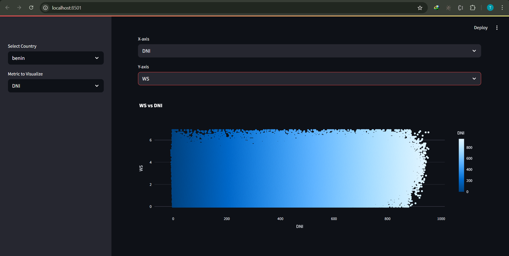
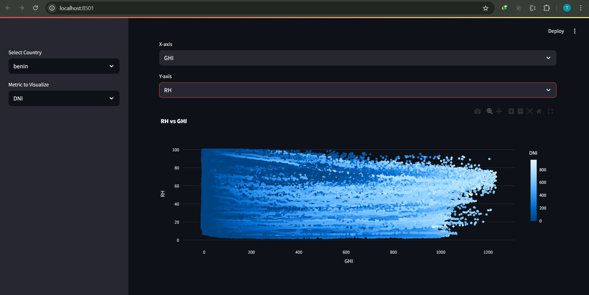

# Solar Challenge Week 1

## Setup Instructions

### Clone the repo
```bash
    git clone https://github.com/your-username/solar-challenge-week1.git
    cd solar-challenge-week1
```

### Create virtual environment
```bash
    py -m venv venv
    source venv/Scripts/activate
```

### Install dependencies
```bash
    pip install -r requirements.txt
```

### Ensure cleaned CSVs are in the /data folder, named like:
```bash
    data/benin_clean.csv
    data/togo_clean.csv
    data/sierraleone_clean.csv
```

### Run the Streamlit app:
```bash
    streamlit run streamlit_app/app.py
```

## Folder Structure
```
├── .vscode/
│   └── settings.json
├── .github/
│   └── workflows/
│       └── ci.yml
├── .gitignore
├── requirements.txt
├── README.md
├── dashboard_screenshots/ # streamlit dashboard sample screenshots
│   ├── ghi_vs_tamb.png # Explore how temperature correlates with solar energy potential. 
│   ├── dni_vs_ws.png # Check if higher winds influence direct solar radiation.
│   ├── ghi_vs_rh_bubble.png # Multivariate view showing solar potential vs. environment
│   └── moda_vs_modb_cleaning.png # Check the impact of cleaning on module output.
├── notebooks/ # EDA and comparison Jupyter notebooks
│   ├── sierraleone_eda.ipynb
│   ├── benin_eda.ipynb
│   ├── compare_countries.ipynb
│   └── togo_eda.ipynb
├── streamlit_app/
│   ├── pages/
│   ├── utils/
│       └── data_loader.py # Helper function to load data
│   └── app.py Main Streamlit app
├── tests/
│   ├── __init__.py
└── scripts/
    ├── __init__.py
    └── README.md
```
## 📸 Dashboard Screenshots

### 1. GHI vs. Tamb
Insight: Explore how temperature correlates with solar energy potential.  


### 2. DNI vs. Wind Speed
Insight: Check if higher winds influence direct solar radiation.  


### 3. GHI vs. RH with Bubble Size = BP
Insight: Multivariate view showing solar potential vs. environment.  


### 4. ModA vs. ModB with Cleaning Flag
Insight: Check the impact of cleaning on module output.  


### 5. GHI Over Time (Sierraleone)
Insight: Daily pattern of solar potential in Benin.  

