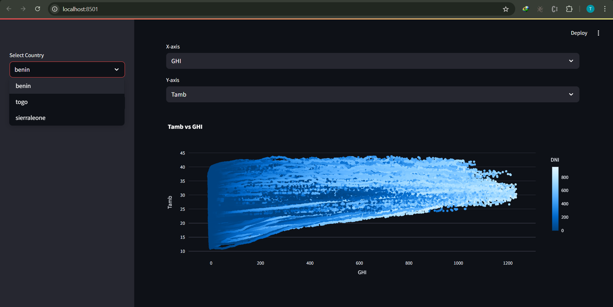
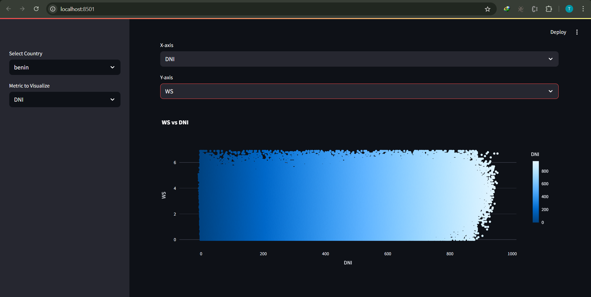
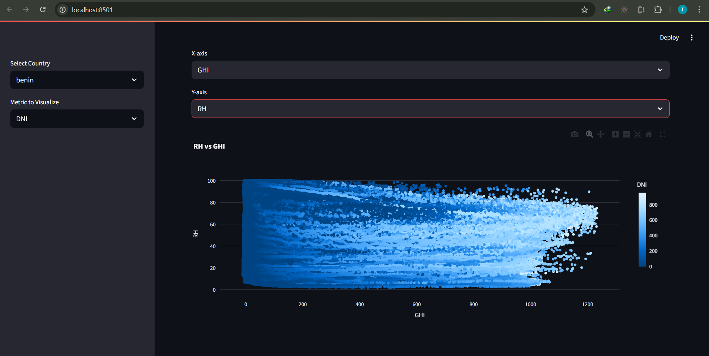
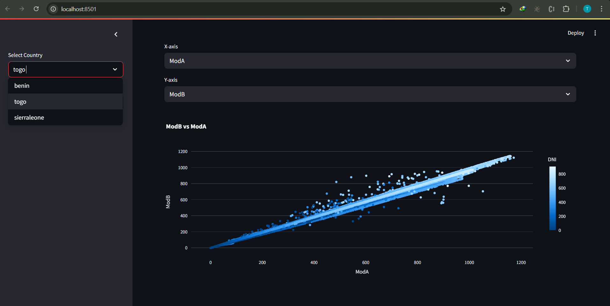
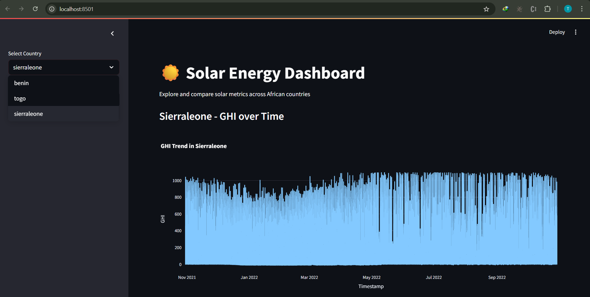

## 📸 Dashboard Screenshots

### 1. GHI vs. Tamb
Insight: Explore how temperature correlates with solar energy potential.  

### 2. DNI vs. Wind Speed
Insight: Check if higher winds influence direct solar radiation.  

### 3. GHI vs. RH with Bubble Size = BP
Insight: Multivariate view showing solar potential vs. environment.  

### 4. ModA vs. ModB with Cleaning Flag
Insight: Check the impact of cleaning on module output.  

### 5. GHI Over Time (Sierraleone)
Insight: Daily pattern of solar potential in Benin.  

